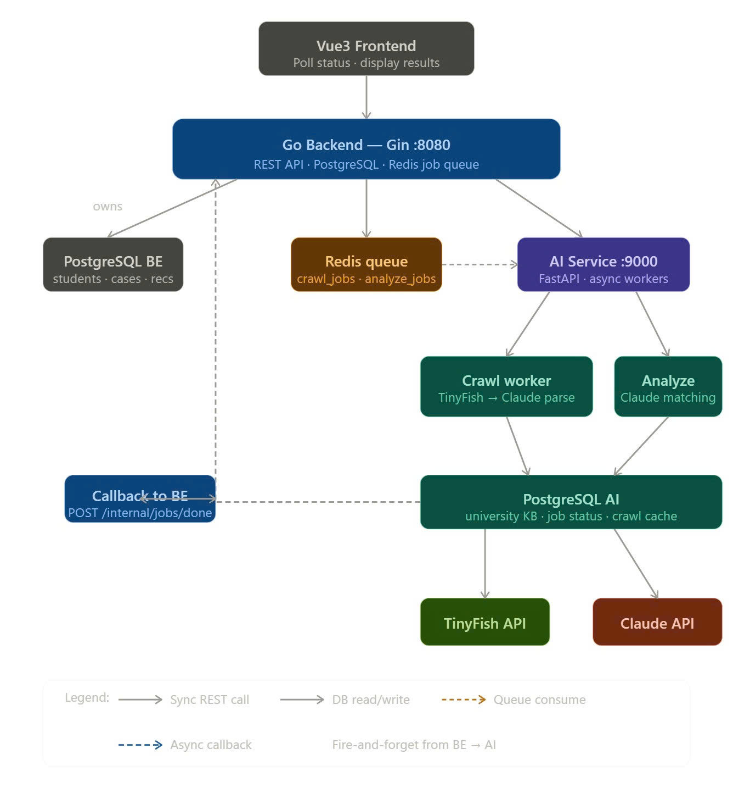

# UniMatch Copilot: Architecture & Technical Instructions

## Overview
UniMatch Copilot is an intelligent study-abroad counseling system that fully automates university data aggregation and student profile analysis. By orchestrating traditional business logic with autonomous AI agents, the platform dynamically evaluates student capabilities against real-time university requirements and delivers highly accurate, AI-driven university recommendations powered by a dedicated Knowledge Graph.

## System Architecture

The project follows a decoupled, event-driven Microservices architecture consisting of three primary operational nodes.

## 1. Technology Stack

### 1.1. Frontend (Web Client)
- **Core:** Vue 3 (Composition API) powered by Vite
- **State & Routing:** Pinia, Vue Router
- **Styling:** Tailwind CSS

### 1.2. Backend (Core API & Orchestrator)
- **Core:** Golang with Gin HTTP Framework
- **Primary Database:** PostgreSQL (Business logic: Students, Cases, Recommendations)
- **Caching & Operations:** Redis

### 1.3. AI Service (Autonomous Worker)
- **Core:** Python with FastAPI
- **LLM Engine:** Claude Agent SDK 
- **Tooling:** TinyFish MCP (Model Context Protocol) Tools (`web_search`, `fetch_page`)
- **Semantic Database:** Neo4j (Knowledge Graph for contextual mapping of universities and programs)
- **State Database:** PostgreSQL (AI job state tracking, task queues, and raw crawl cache)

## 2. Core Architectural Principles

### 2.1. Orchestrator-Worker Paradigm
The Golang Backend operates as the central **Orchestrator**, managing user data, application states, and UI interactions. The Python AI Service functions as an autonomous **Worker**. The Orchestrator remains entirely agnostic to the Worker's internal mechanics—it does not possess structural knowledge of Claude models or Neo4j queries, ensuring zero domain leakage and enforcing strict boundaries via API contracts.

### 2.2. Asynchronous Fire-and-Forget Architecture
All heavy computational workflows (e.g., University Web Crawling, Candidate Profile Analysis, PDF Report Generation) are completely decoupled:
1. The Backend dispatches a job payload and immediately receives an `accepted: true` acknowledgment.
2. The AI Service consumes the job utilizing background queues (`asyncio.Queue` / Workers).
3. Upon completion, the AI Service pushes the processed results back to the Backend via a standardized webhook callback (`POST /internal/jobs/done`).
4. The Frontend maintains UI parity via intelligent polling and live metric updates.

### 2.3. Polyglot Persistence & Storage Isolation
Data is strictly segregated across three independent database environments to optimize performance and security:
- **Backend PostgreSQL:** Serves as the ultimate source of truth for counseling operations.
- **AI PostgreSQL:** Operates exclusively as temporary state memory, tracking async job statuses and caching raw HTML responses.
- **Neo4j Knowledge Graph:** Maintains a dynamic semantic web of interconnected entities (Universities, Degree Programs, IELTS Requirements, Scholarships). This graph is autonomously synthesized and updated by the AI Agent during its research pathways.

### 2.4. Autonomous Agentic Enrichment
When the Backend requires data enrichment, it transmits a structured payload containing known values and `null` pointers for missing data. The Claude Agent autonomously formulates a research strategy, utilizes TinyFish tools to navigate external sources, extracts the targeted information, and maps it directly to the Knowledge Graph without human intervention. The AI then constructs an incremental patch, transmitting only the successfully discovered data points back to the Backend.
